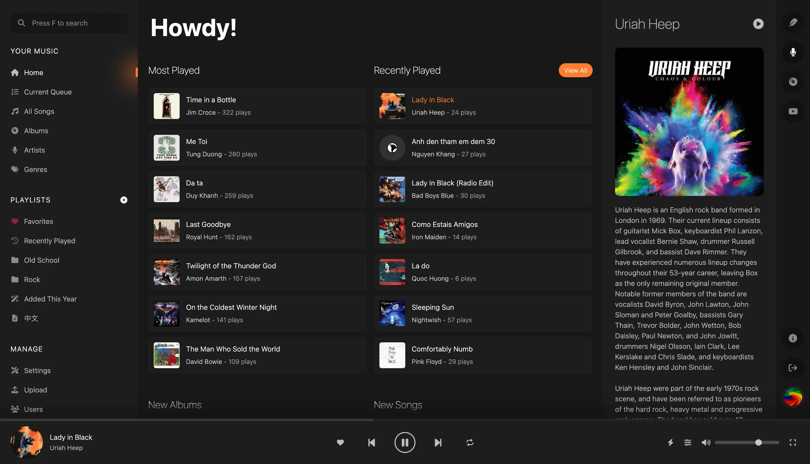

 

# What Is Sparkle?

A complete music streaming solution that hosts and streams your own music collection, Sparkle is designed to be:

* **Modern and snappy** – Unlike some of our music, we’re not living in the 90s anymore. Sparkle looks and functions like a true modern application: clean, gorgeous, and fast. As a matter of fact, it won’t even work on prehistoric browsers.
* **Easy to set up** – Born from a personal frustration of failing to find something easy to install, Sparkle is dead-simple to get up and running, utilizing some of the most popular and proven technologies in the web development world: [Laravel](https://laravel.com), [Vue](https://vuejs.org), and [Docker](https://www.docker.com/).
* **Easy to use** – As Sparkle’s interface draws inspiration from proven streaming services like Spotify and Apple Music, you will feel right at home where everything is exactly where you’d expect it to be.
* **Feature-rich** – Apart from the standard functionalities (stream, search, song/album/artist browsing, playlist management, etc.), Sparkle provides advanced features like smart playlists, equalizer, visualizers, 3rd-service integrations, and many more.

:::tip TL;DR
Sparkle is a music streaming solution that actually works™.
:::
